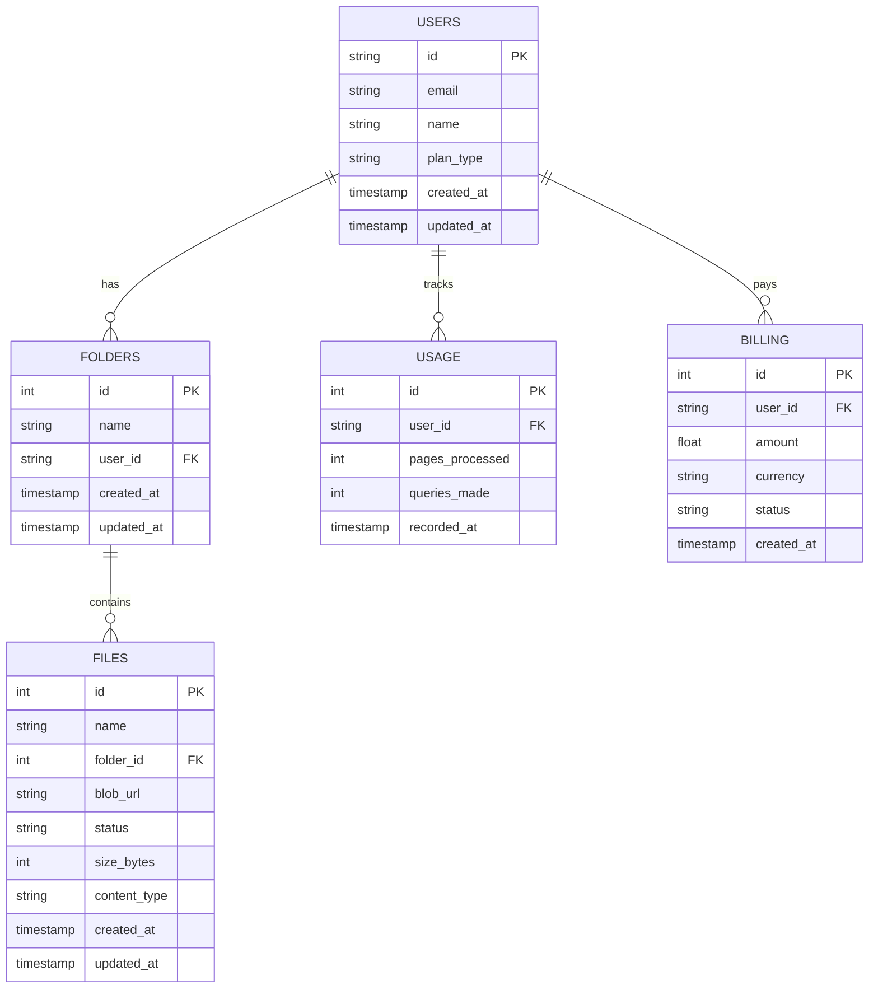

# OCR LAB - Architecture Document

**Status: Approved**

## Overview

This document outlines the architecture of OCR LAB, a web application for advanced OCR extraction on PDF documents with semantic search capabilities. The architecture is designed to be scalable, maintainable, and secure, leveraging Azure services for core functionality.

## System Architecture

### High-Level Architecture Diagram


### Component Breakdown

1. **Frontend (Client-Side)**
   - React + Vite application
   - shadcn/ui components with TailwindCSS
   - Clerk for authentication
   - React Query for data fetching and state management

2. **Backend (Server-Side)**
   - Azure Functions for serverless API endpoints
   - Python-based microservices for OCR processing
   - REST API for file/folder management and search
   - Timer-triggered functions for background tasks

3. **Storage & Database**
   - Azure Blob Storage for PDF file storage
   - PostgreSQL for metadata and user data
   - Azure AI Search for vector embeddings and semantic search

4. **Authentication & Security**
   - Clerk for user authentication and management
   - API key authentication for external clients
   - Secure data transmission with HTTPS
   - Automated user synchronization between Clerk and PostgreSQL

5. **Processing Pipeline**
   - Azure Queue for asynchronous processing
   - Azure Document Intelligence for OCR extraction
   - Vector embedding generation for semantic search

6. **Background Services**
   - Timer-triggered Azure Functions for scheduled tasks
   - User synchronization between Clerk and PostgreSQL
   - Maintenance and cleanup processes

## Detailed Architecture

### Frontend Architecture

The frontend is built with React and Vite, using shadcn/ui components and TailwindCSS for styling. The application follows a component-based architecture with the following structure:

```
frontend/
├─ src/
│  ├─ components/
│  │  ├─ layout/
│  │  │  ├─ Sidebar.tsx
│  │  │  ├─ Header.tsx
│  │  │  └─ Layout.tsx
│  │  ├─ folders/
│  │  │  ├─ FolderList.tsx
│  │  │  ├─ FolderCard.tsx
│  │  │  └─ CreateFolderDialog.tsx
│  │  ├─ files/
│  │  │  ├─ FileList.tsx
│  │  │  ├─ FileCard.tsx
│  │  │  ├─ FileUpload.tsx
│  │  │  └─ FileStatus.tsx
│  │  ├─ search/
│  │  │  ├─ SearchBar.tsx
│  │  │  ├─ SearchResults.tsx
│  │  │  └─ SearchFilters.tsx
│  │  └─ dashboard/
│  │     ├─ UsageStats.tsx
│  │     ├─ RecentFiles.tsx
│  │     └─ ProcessingQueue.tsx
│  ├─ pages/
│  │  ├─ Dashboard.tsx
│  │  ├─ Folders.tsx
│  │  ├─ Files.tsx
│  │  ├─ Search.tsx
│  │  ├─ Usage.tsx
│  │  └─ Billing.tsx
│  ├─ hooks/
│  │  ├─ useFiles.ts
│  │  ├─ useFolders.ts
│  │  ├─ useSearch.ts
│  │  └─ useAuth.ts
│  ├─ services/
│  │  ├─ api.ts
│  │  ├─ auth.ts
│  │  └─ storage.ts
│  ├─ utils/
│  │  ├─ formatters.ts
│  │  └─ validators.ts
│  ├─ App.tsx
│  └─ main.tsx
├─ public/
│  ├─ assets/
│  └─ index.html
└─ package.json
```

#### Key Design Decisions:

1. **Component Structure**
   - Reusable UI components organized by feature
   - Layout components for consistent page structure
   - Feature-specific components for folders, files, search, etc.

2. **State Management**
   - React Query for server state management
   - React Context for global application state
   - Local component state for UI-specific state

3. **Styling**
   - TailwindCSS for utility-based styling
   - shadcn/ui for pre-built components
   - Consistent color palette and typography

4. **Routing**
   - React Router for client-side routing
   - Protected routes for authenticated users
   - Nested routes for related features

### Backend Architecture

The backend is built with Azure Functions and Python, following a service-oriented architecture with the following structure:

```
backend/
├─ api/
│  ├─ routes/
│  │  ├─ files.py
│  │  ├─ folders.py
│  │  ├─ search.py
│  │  ├─ usage.py
│  │  └─ billing.py
│  └─ middleware/
│     ├─ auth.py
│     └─ rate_limit.py
├─ services/
│  ├─ ocr.py
│  ├─ storage.py
│  ├─ search.py
│  ├─ usage.py
│  └─ billing.py
├─ db/
│  ├─ database.py
│  └─ models.py
├─ config/
│  └─ settings.py
└─ requirements.txt
```

#### Key Design Decisions:

1. **API Layer**
   - RESTful API endpoints for file/folder management and search
   - Authentication middleware for secure access
   - Rate limiting for API protection

2. **Service Layer**
   - Separation of concerns with dedicated services
   - OCR service for document processing
   - Storage service for file management
   - Search service for vector database operations

3. **Data Layer**
   - PostgreSQL for relational data
   - Azure Blob Storage for file storage
   - Azure AI Search for vector embeddings

4. **Configuration**
   - Environment-based configuration
   - Secrets management with Azure Key Vault
   - Feature flags for optional features

### Database Schema

The PostgreSQL database has the following schema:



### Processing Pipeline

The OCR processing pipeline follows these steps:

1. User uploads a PDF file through the frontend
2. File is stored in Azure Blob Storage
3. A message is added to Azure Queue with file details
4. OCR Processing Service picks up the message
5. Azure Document Intelligence extracts text, tables, images, and handwriting
6. Extracted content is processed and chunked
7. Text chunks are embedded and stored in Azure AI Search
8. File status is updated in the database
9. User can search and retrieve the processed content


### Background Services

The application includes several background services implemented as timer-triggered Azure Functions:

1. **Clerk User Synchronization**
   - Runs every 15 seconds via a TimeTrigger
   - Fetches users from Clerk's API
   - Creates or updates users in PostgreSQL database
   - Maintains consistency between authentication system and application database


2. **Failed Job Cleanup** (optional)
   - Runs on a scheduled basis (e.g., hourly)
   - Identifies stalled or failed processing jobs
   - Requeues or marks jobs as failed based on configurable thresholds

3. **Usage Aggregation** (optional)
   - Runs on a daily or weekly schedule
   - Aggregates usage statistics for reporting and billing
   - Generates summary data for administrative dashboards

## Technical Decisions

### Technology Choices

1. **Frontend Framework: React + Vite**
   - **Context:** Need for a modern, component-based UI with fast development
   - **Decision:** Use React with Vite for optimal development experience
   - **Consequences:** Fast development, good developer experience, modern tooling

2. **UI Components: shadcn/ui + TailwindCSS**
   - **Context:** Need for consistent, accessible UI components
   - **Decision:** Use shadcn/ui with TailwindCSS for styling
   - **Consequences:** Consistent design, customizable components, utility-based styling

3. **Authentication: Clerk**
   - **Context:** Need for secure, easy-to-implement authentication
   - **Decision:** Use Clerk for authentication and user management
   - **Consequences:** Simplified auth flow, secure token handling, user management features

4. **User Synchronization: Azure Functions Timer Trigger**
   - **Context:** Need to maintain consistent user data between Clerk and PostgreSQL
   - **Decision:** Implement a 15-second timer-triggered Azure Function for synchronization
   - **Consequences:** Automatic data consistency, reduced manual intervention, reliable user management

5. **Backend: Azure Functions**
   - **Context:** Need for scalable, serverless API endpoints
   - **Decision:** Use Azure Functions for the API layer
   - **Consequences:** Serverless architecture, pay-per-use pricing, automatic scaling

6. **OCR: Azure Document Intelligence**
   - **Context:** Need for advanced OCR capabilities
   - **Decision:** Use Azure Document Intelligence for OCR extraction
   - **Consequences:** High-quality OCR, table extraction, image processing, handwriting recognition

7. **Vector Database: Azure AI Search**
   - **Context:** Need for semantic search capabilities
   - **Decision:** Use Azure AI Search for vector storage and search
   - **Consequences:** Efficient vector search, integration with Azure ecosystem, scalable search

8. **Database: PostgreSQL**
   - **Context:** Need for relational data storage
   - **Decision:** Use PostgreSQL for metadata and user data
   - **Consequences:** Reliable relational database, ACID compliance, rich query capabilities

### Security Considerations

1. **Authentication**
   - Clerk for secure user authentication
   - JWT token validation for API requests
   - API key authentication for external clients

2. **Data Protection**
   - HTTPS for all communications
   - Encrypted storage for sensitive data
   - Proper access controls for user data

3. **API Security**
   - Rate limiting to prevent abuse
   - Input validation to prevent injection attacks
   - CORS configuration to restrict access

### Scalability Considerations

1. **Horizontal Scaling**
   - Stateless API design for easy scaling
   - Azure Functions auto-scaling for API endpoints
   - Queue-based processing for OCR workload distribution

2. **Performance Optimization**
   - Efficient database queries with proper indexing
   - Caching for frequently accessed data
   - Optimized vector search with appropriate chunking

3. **Resource Management**
   - Monitoring and alerting for resource usage
   - Auto-scaling based on demand
   - Cost optimization strategies

## Implementation Plan

1. **Phase 1: Project Setup and Infrastructure**
   - Set up development environment
   - Configure Azure resources
   - Set up database schema
   - Implement authentication

2. **Phase 2: Core Functionality**
   - Implement folder management
   - Implement file upload and storage
   - Develop OCR processing pipeline
   - Implement vector database integration

3. **Phase 3: User Interface**
   - Create responsive layout
   - Implement folder browsing interface
   - Develop file management UI
   - Create search interface

4. **Phase 4: Advanced Features**
   - Implement REST API endpoints
   - Develop usage tracking
   - Integrate billing (optional)

5. **Phase 5: Testing and Deployment**
   - Write and run tests
   - Deploy to production
   - Create documentation
   - Monitor and optimize

## Risks and Mitigations

1. **Risk: Azure Document Intelligence may not handle all document types equally well**
   - **Mitigation:** Implement pre-processing steps for complex documents, test with various document types, provide feedback to users on supported formats

2. **Risk: Vector search performance may degrade with large document collections**
   - **Mitigation:** Implement proper chunking strategies, optimize index configuration, consider sharding for very large collections

3. **Risk: Integration between multiple Azure services may introduce complexity**
   - **Mitigation:** Use managed services where possible, implement proper error handling and retry logic, maintain comprehensive monitoring

4. **Risk: Security vulnerabilities in the application**
   - **Mitigation:** Regular security audits, follow security best practices, implement proper authentication and authorization

## Conclusion

The OCR LAB architecture is designed to provide a scalable, maintainable, and secure solution for OCR extraction and semantic search. By leveraging Azure services and following best practices in software design, the system can handle the requirements outlined in the PRD while providing room for future expansion.

## Change Log

| Change | Story ID | Description |
|--------|----------|-------------|
| Initial Architecture | story-1 | Initial approved system design and documentation |
| Add Clerk-PostgreSQL Synchronization | story-3 | Implemented a 15-second TimeTrigger Azure Function to automatically sync Clerk users with PostgreSQL database | 